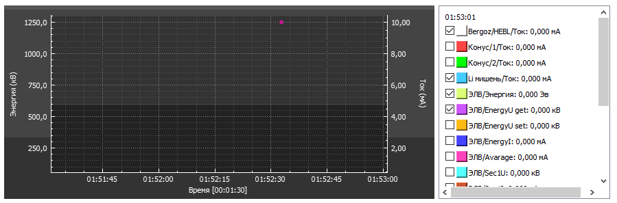
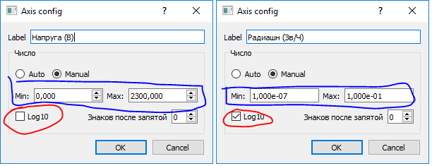
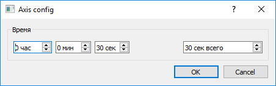
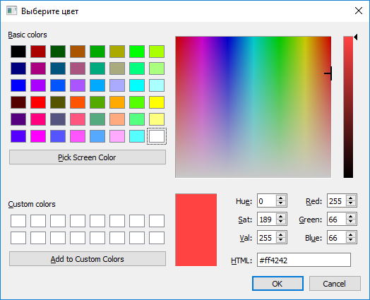
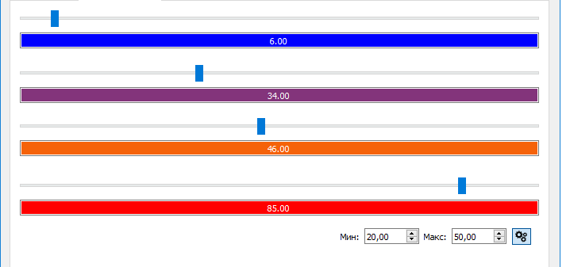
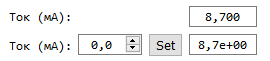

# lib
Library with most common classes, that are developed during automation BNCT experimental facility

*This readme is still under construction. Some errors may be present*

## Getting Started
This lib is tested in Qt 5.14.0 and Qt Creator 4.11.0


* Check examples in *main.c* and *mainwindow.cpp* files to see, how to use lib
* Add *lib* folder to your project
* Add in .pro file this lines
```
QT       += printsupport network
INCLUDEPATH += ./
```
* In project area click on *projectName* -> *Add existing directory* and select *lib* folder
* Fin. You are perfect!

# Most common classes and methods:

## UI

### RealTimeQCP



Realtime plot with:
* Full axis config (time and value). for Y axis it is possible to set **Scientific notation and precision**
* Powerful **legend and mouse iterations**
* It is possible to add **cursor** (like in a oscilloscope) and see delta time and values in legend. 
* Legend allow to change graph **color and visibility**.
* It is possible to use **2 seporated Y axies**

This plot is based on QCustomPlot

Now avaiable in Russian, but can easyly translated by Qt *tr()* macro.





### GradientLineEdit

This is QLineEdit with color representation of double value. *(May be better to inherit from QDoubleSpinBox)*



### Worker

Background worker, that works in sepoporated thread. Good for heavy tasks.

### ScientificNotationEdit

This widget allow to display and set values in **scientific notation**. See example picture from *RealTimeQCP*

### ValueDouble

This widget allow to display and set double values. This widget have *set value* field, *Set* button (Enter also works), *get value*.
In picture first is with setter fields, and in second picture are only display fields



## Channels

### Channel \<Templated\>

This class allow to make any type of cahnnels (double, bool, int and ect.) with this basic fields:
* value (any type)
* postfix (usually physical value)
* color
* logName
* widgetName
* plotName

### ChannelDouble 
* addGraphToPlot (easely works with *RealTimeQCP*)
* scientificNotation
* precision
* setRawValue (example: raw value from ADC. setToScaledFunc need to be executed)
* rawValue (example: raw value to DAC. setToRawFunc need to be executed)

## Logs

This code allow basic functionality of logging

### Excel

Allow to automatically log values to \*.xlsx file every N seconds

### SQL

Not implemented yet

## Shared variables

Allow to **easely** send values via network with **TCP or UDP** protocols

## EasyLeaving

* formatDouble (precision, scientificNotation, seporatorSign)
* formatDateTime
* default physical postfixes
* isBetween (double and QDateTime)
* isEqualDouble (sheck with std::numeric_limits)

### ErrorHandler

Custom error handler. Not shure this is common for C++


## Author

 **Alexey K.** koshi8bit@mail.ru
 All discussions are welcome! If you have some advices - please let me know :D
 
## Acknowledgments

* [Qt developers](https://www.qt.io/)
* [QCustomPlot](https://www.qcustomplot.com/) library developers 
* Work colleagues and Budker Institute of Nuclear Physics
* My wife and dog

## License
If use - please provide link to this repository
```
https://github.com/koshi8bit/lib
```
